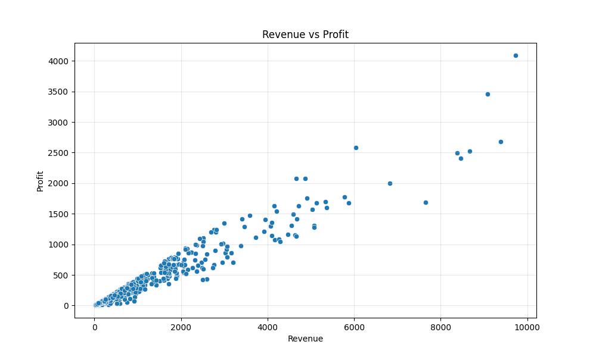
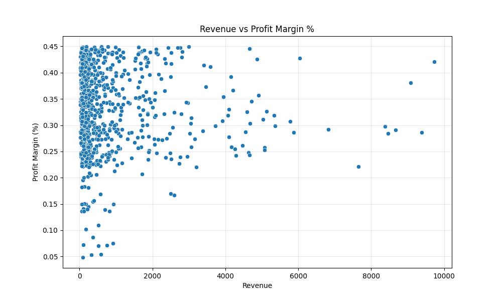

# Sales Correlation Analysis

**Analysis of the relationship between Revenue, Profit, and Profit Margins** in a retail sales dataset. This project investigates whether high-revenue products also deliver high profits and strong margins, or if there are important trade-offs.

## Project Overview
This analysis explores correlations between key financial metrics to understand product performance and potential risks.

## Technologies Used
- Python
- Pandas
- Matplotlib
- Seaborn
- openpyxl

## Key Insights
- Revenue and Profit have a very strong positive correlation (0.971).
- Revenue and Profit Margin % show almost no correlation (-0.028).
- High revenue does **not** guarantee high profit margins.

## Visualizations



## Actionable Recommendations

1. **Webcam requires attention** — it has a notably high return rate, suggesting a mismatch between customer expectations and product reality. Improving quality or clarifying product specifications should be prioritized.

2. **Aggressively promote the Docking Station** — it offers excellent profit margins and near-zero returns. Increasing its visibility and sales volume could significantly boost overall profitability.

3. **High-revenue, low-margin products (such as Monitor) are risky** — they depend heavily on maintaining high sales volume. Reducing production costs or adjusting pricing could help widen margins and reduce vulnerability.

4. **Revenue growth should not be pursued in isolation** — since revenue and profit margins show almost no correlation, growth strategies must also consider margin health.

## Limitations & Future Work
- Synthetic dataset.
- Correlation does not imply causation.
- **Next**: Add category/region breakdowns and interactive dashboard.

## How to Run
```bash
pip install -r requirements.txt
python correlation_analysis.py
